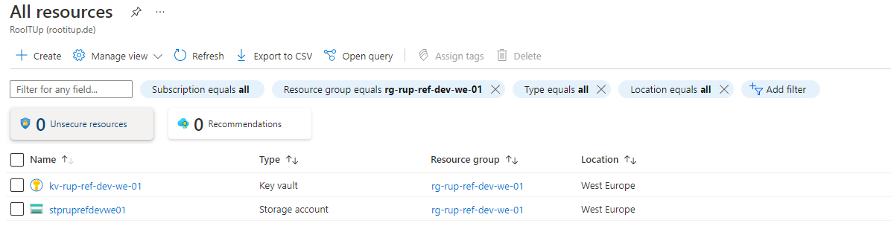
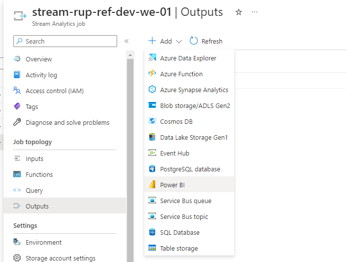
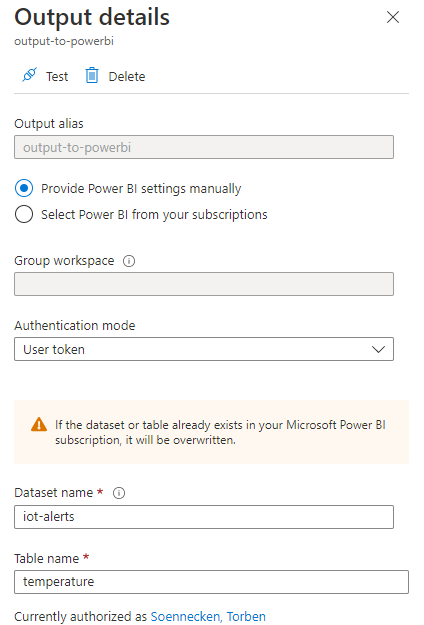
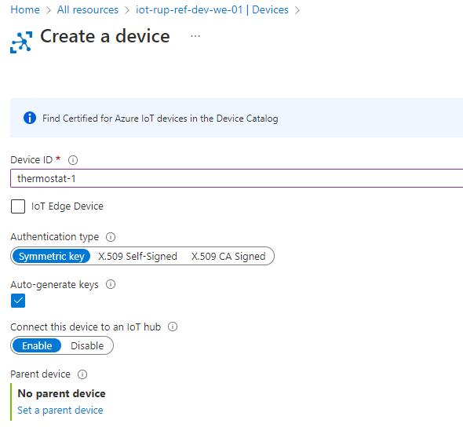

# Introduction 
This repository contains all information for a reference IoT architecture. Importantly, the official [resource naming conventions](https://learn.microsoft.com/en-us/azure/cloud-adoption-framework/ready/azure-best-practices/resource-naming) should be followed at all times.

# Getting Started
1. To create the required resources within azure simply run the following command in your powershell.
```powershell
az login
.\New-ReferenceResources.ps1 -LicenseId "MY_AZURE_SUBSCRIPTION_ID"
```


2. Configure an Azure DevOps service connection using the secrets found within the key vault.
    - Azure Resource Manager
    - Service principal (manual)
        - Service Principal Id **obtained from key vault**
        - Service principal key **obtained from key vault**
        - Tenant ID **obtained from key vault**
        - Grant access permission to all pipelines
3. Run an Azure DevOps pipeline for the terraform pipeline
4. Wait (and drink tea)
5. Create a PowerBI output with the name **output-to-powerbi** for the Stream Analytics job





6. Start the Stream Analytics job
7. Register a new device within the IoT-Hub



8. Configure the thermostat application and run it.
9. Add yourself to Azure Data Explorer Database as administrator.
10. Create dashboards
    - https://app.powerbi.com/groups/me/list
    - https://dataexplorer.azure.com/dashboards/