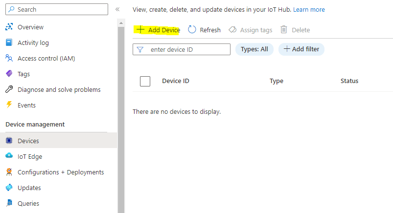
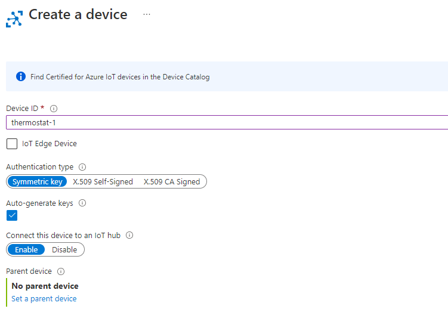

# Introduction 
This repository contains a dummy client that send telemetry data within a given reference architecture. 

# Getting Started

1. Create a new device within the IoT Hub.

2. Configure this exemplary client implementation (e.g. through appsettings.json, see [options pattern](https://learn.microsoft.com/en-us/aspnet/core/fundamentals/configuration/options?view=aspnetcore-7.0)) with the values obtained for your added device.
- DeviceId is the ID you specified during creation
- Symmetric Key is the Primary key you can obtain from the created device
- HostName is the FQDN of your Azure IoT Hub e.g. iot-rup-ref-dev-we-01.azure-devices.net